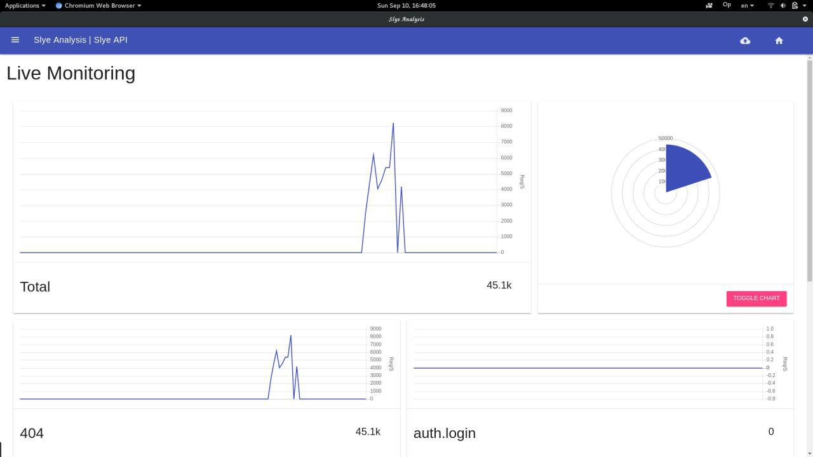

# SlyeAnalysis
Slye's analysis panel



# Running server
Install the server globally:
```
sudo npm install -g slye-analysis
```
and then start the server:
```
slye-analysis
```
It will starts a TCP server listing at `9898` and HTTP Server for Human-Interface at `9899` 

# Use with express:

main.js
```js
var express = require('express');
var SlyeAnalysis = require('SlyeAnalysis')('127.0.0.1', 9898, 'myAwesomeApp')
var app = express();
app.set('Analysis', SlyeAnalysis)
```
somewhere else:
```js
app.get('/someWhere', function(req, res, next){
    ...
    req.app.get('Analysis').view('req', 'my.awsome.endpoint')
    ...
})
```
